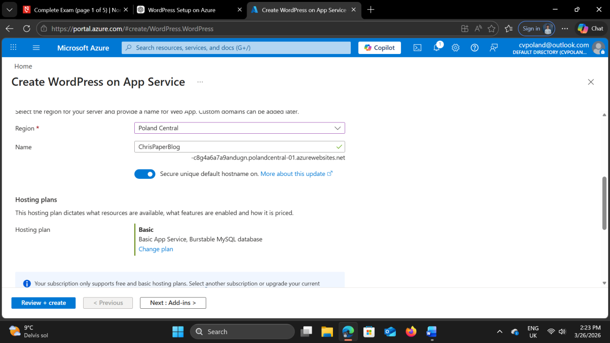
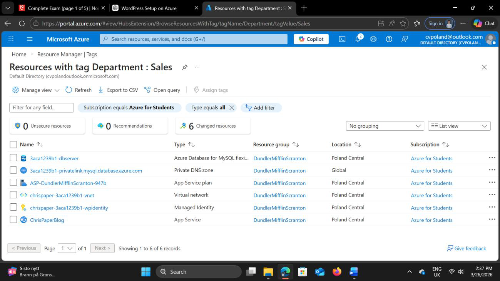
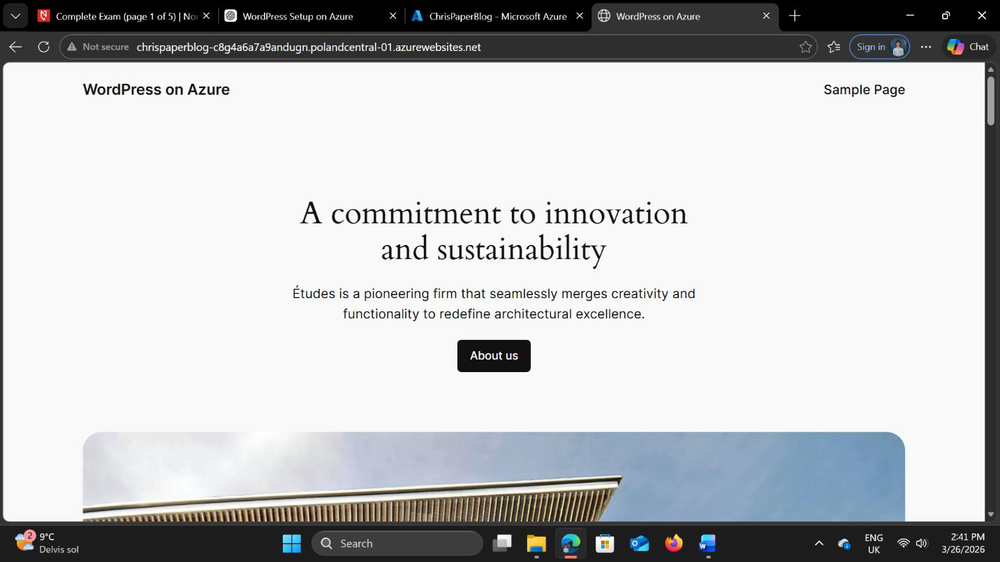
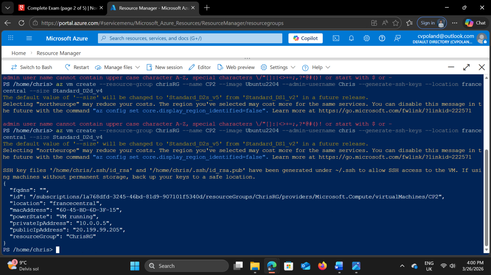
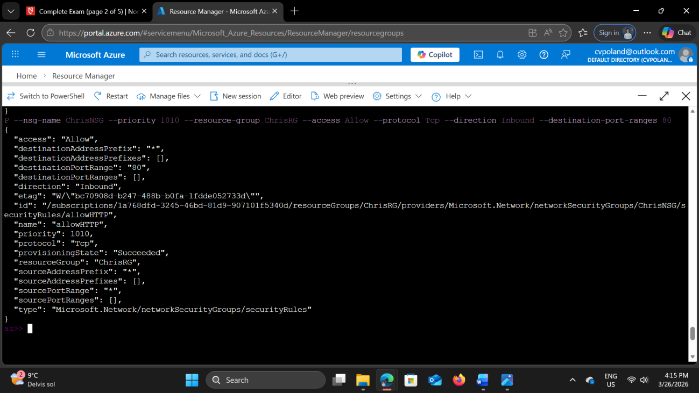
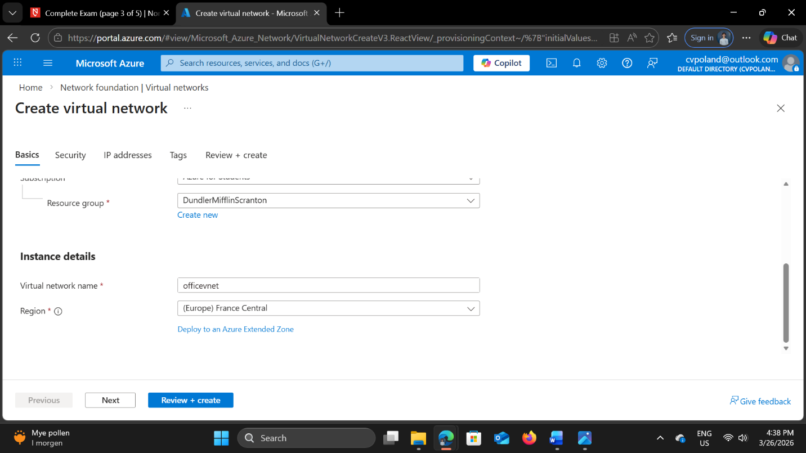
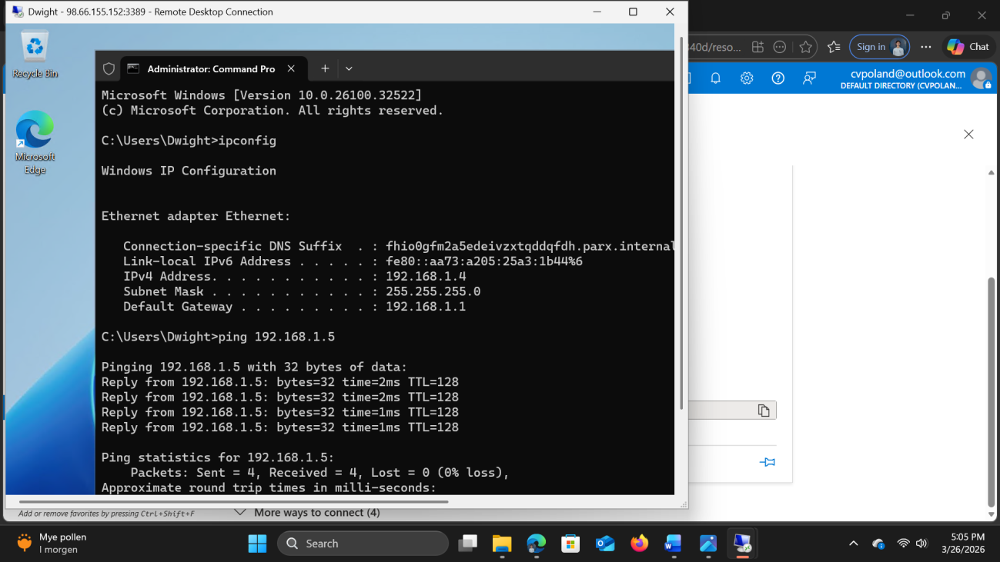
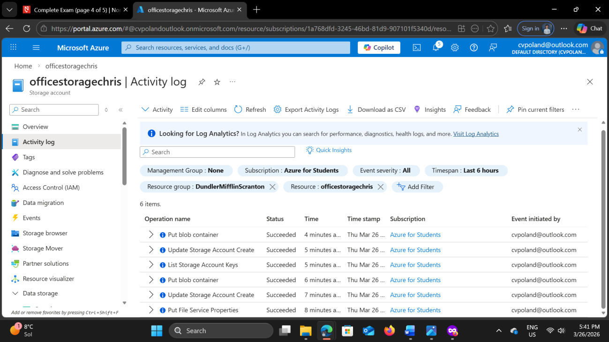
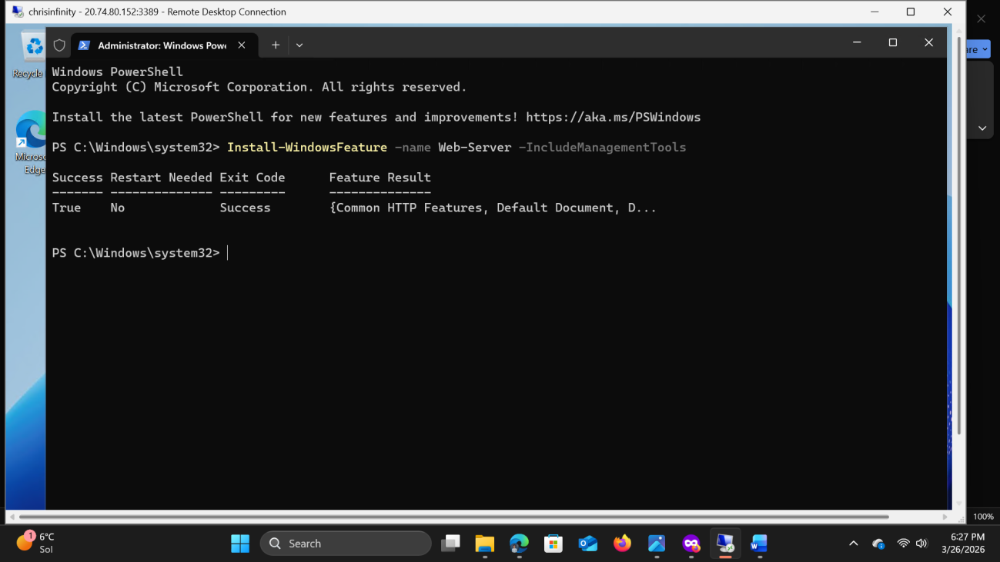
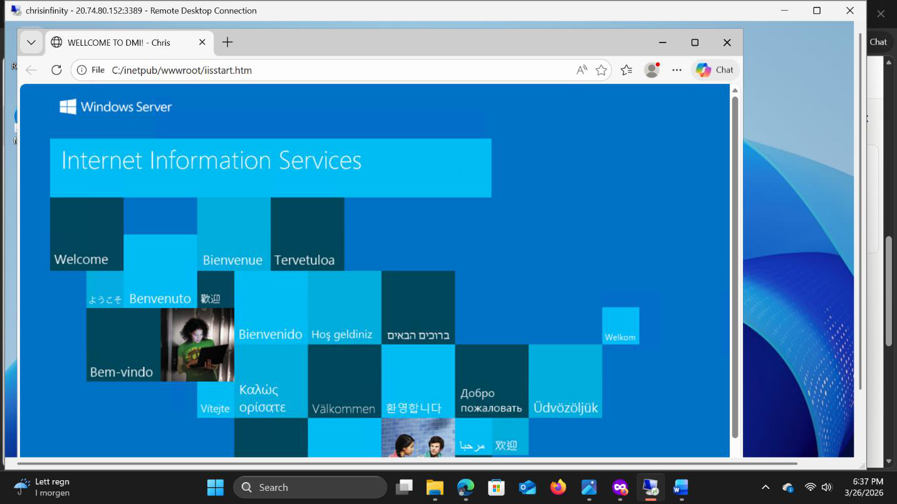

# Microsoft Azure Cloud Infrastructure Lab

A hands-on Microsoft Azure lab demonstrating the deployment, configuration and testing of cloud infrastructure across compute, networking, storage and web services.

The project covers both Windows and Linux environments and uses the Azure Portal, Azure CLI and PowerShell to deploy and administer cloud resources.

The objective was to develop practical experience with core Azure services while understanding how cloud infrastructure can be organised, secured, automated and scaled within a business environment.

---

## Technologies & Services

- Microsoft Azure
- Azure Virtual Machines
- Azure Virtual Network (VNet)
- Network Security Groups (NSGs)
- Azure App Service
- Azure Storage
- Azure Blob Storage
- Azure Resource Groups
- Azure Resource Tags
- Azure CLI
- PowerShell
- Windows Server
- Ubuntu Linux
- IIS
- Nginx
- WordPress
- MySQL
- SSH
- RDP

---

# 1. Azure App Service & PaaS Deployment

A WordPress web application was deployed using Azure App Service with an associated MySQL database.

Rather than managing the underlying operating system and physical infrastructure directly, the application was deployed using Azure's managed Platform as a Service (PaaS) environment.

This provided practical experience with the distinction between managing infrastructure directly through virtual machines and consuming managed cloud services.

The deployment included:

- Creating a dedicated Azure Resource Group
- Configuring WordPress through Azure App Service
- Deploying an associated MySQL database
- Selecting an appropriate hosting plan
- Configuring deployment regions based on service availability
- Applying resource tags for organisational and cost-management purposes
- Verifying successful deployment through the application's public endpoint

### App Service Configuration

The WordPress application was configured through Azure App Service using an available Basic hosting plan.

### Resource Organisation & Tagging

Resource tags were applied to associate the deployed resources with the relevant business department.

Using consistent tagging allows organisations to group resources for purposes such as cost allocation, reporting, administration and governance.

### Deployment Validation

After deployment, the WordPress application was accessed through its public URL to verify that the service was operating successfully.

---

# 2. Infrastructure Deployment with Azure CLI

Azure infrastructure was also deployed using command-line tools rather than relying exclusively on the Azure Portal.

Ubuntu virtual machines were provisioned using Azure CLI and configured remotely through SSH.

This demonstrated a more repeatable and administration-focused approach to cloud infrastructure deployment.

Tasks included:

- Creating Azure resources through the command line
- Provisioning Ubuntu Linux virtual machines
- Connecting to remote systems using SSH
- Installing and configuring Nginx
- Working with public and private IP addressing
- Configuring network access through Azure Network Security Groups

### Virtual Machine Deployment

Azure CLI was used to create and configure virtual machine resources.

### Linux Web Server Deployment

After connecting to the Linux environment, Nginx was installed and the web service was tested to confirm that the deployment was accessible.

---

# 3. Azure Virtual Networking

A virtual network environment was created to provide communication between Azure virtual machines.

The environment included a dedicated Azure Virtual Network and subnet with Windows Server virtual machines connected to the same internal network.

This provided practical experience with Azure networking concepts including:

- Virtual Networks
- Subnets
- Private IP addressing
- Virtual network interfaces
- VM-to-VM communication
- Network Security Groups
- Inbound network rules

### Virtual Network Configuration

The virtual network and associated addressing were configured within Azure before deploying the virtual machines.

### Connectivity Testing

Communication between virtual machines was tested using ICMP traffic.

Windows Firewall rules were adjusted where required to permit the traffic, allowing connectivity between systems to be validated.

---

# 4. Network Security Groups

Azure Network Security Groups were used to control traffic reaching deployed resources.

An inbound security rule was configured to permit HTTP traffic over TCP port 80 to the Linux web server.

This demonstrated the role of NSGs as a network-level access-control mechanism within Azure.

The configuration involved:

- Creating and associating an NSG
- Defining inbound traffic rules
- Configuring protocol and destination ports
- Allowing required web traffic while maintaining network access controls
- Testing access to the deployed web service

This reinforced the principle that cloud services should expose only the network access required for their intended purpose.

---

# 5. Azure Blob Storage

Azure Storage was configured to provide cloud-based object storage.

A storage account using Locally Redundant Storage (LRS) was created and a Blob Storage container was configured.

The exercise included:

- Creating an Azure Storage account
- Selecting an appropriate redundancy model
- Creating a Blob container
- Uploading objects to cloud storage
- Configuring blob access settings
- Testing access to stored objects through a web browser

### Storage Access Testing

A file was uploaded to Blob Storage and accessed through its generated URL to verify that the configured access settings worked as expected.

This task also highlighted an important cloud security consideration: storage access settings directly affect whether data can be reached anonymously or requires authentication.

---

# 6. Windows Server & IIS Deployment

A Windows Server virtual machine was provisioned in Azure and administered remotely using Remote Desktop Protocol (RDP).

PowerShell was then used within the server to install Microsoft's Internet Information Services (IIS) web server.

The deployment involved:

- Provisioning a Windows Server virtual machine
- Connecting to the server using RDP
- Installing IIS using PowerShell
- Verifying that the IIS service was running
- Modifying the default IIS web page
- Accessing the deployed web service to confirm successful configuration

### IIS Installation with PowerShell

PowerShell was used to install and configure the IIS role within Windows Server.

### Web Server Validation

The customised IIS page was accessed successfully, demonstrating that the Windows web server had been deployed and configured correctly.

---

# 7. Security Considerations

Although the primary focus of this project was cloud infrastructure, several tasks involved security controls that are fundamental to Azure administration.

These included:

### Network Access Control

Network Security Groups were used to define which traffic could reach Azure resources, including explicitly allowing HTTP traffic where required.

### Host-Based Firewall Configuration

Windows Firewall configuration was considered when testing communication between virtual machines.

### Storage Access

Blob Storage access settings demonstrated how cloud storage permissions can affect whether data is publicly accessible or protected through authentication.

### Remote Administration

Both SSH and RDP were used to administer cloud systems remotely, providing experience with common remote-management protocols across Linux and Windows environments.

### Resource Organisation

Resource groups and tags were used to organise cloud infrastructure and associate resources with business requirements, supporting administration, governance and cost visibility.

---

# 8. Key Skills Demonstrated

This project provided practical experience across several areas of cloud and infrastructure administration.

### Microsoft Azure

- Resource Groups
- Virtual Machines
- Virtual Networks
- Subnets
- Network Security Groups
- App Service
- Azure Storage
- Blob Storage
- Resource tagging

### Networking

- TCP/IP networking
- Private and public IP addressing
- Virtual network configuration
- Network access controls
- HTTP traffic
- ICMP connectivity testing
- Firewall configuration

### Windows Infrastructure

- Windows Server
- Remote Desktop Protocol
- PowerShell administration
- IIS deployment and configuration

### Linux Infrastructure

- Ubuntu Linux
- SSH remote administration
- Nginx deployment
- Command-line system administration

### Cloud Administration

- Azure Portal
- Azure CLI
- PowerShell
- PaaS deployment
- Cloud storage configuration
- Resource organisation
- Service validation and troubleshooting

---

# 9. What I Learned

This project strengthened my understanding of how the different components of a cloud environment work together.

Rather than viewing virtual machines, networks, storage and web services as isolated Azure products, the exercises demonstrated how these services combine to form complete infrastructure.

A particularly useful aspect of the project was working across several different administration methods.

The Azure Portal provided a visual method for configuring and inspecting resources, while Azure CLI and PowerShell demonstrated how infrastructure and systems can be administered from the command line.

Working with both Windows Server and Ubuntu also reinforced the similarities and differences between administering infrastructure across Windows and Linux environments.

The networking exercises helped connect existing TCP/IP knowledge with cloud networking concepts such as VNets, subnets, Network Security Groups and private addressing.

Finally, configuring storage permissions and network access controls demonstrated how security decisions are integrated into everyday cloud administration rather than existing as a separate part of infrastructure management.

---

## Project Context

This lab was completed as part of the Cloud Foundations coursework within the Network & IT Security programme at Noroff School of Technology and Digital Media.

The original work consisted of multiple practical Azure tasks covering cloud services, infrastructure deployment, networking, storage and administration. This repository consolidates those exercises into a single portfolio project demonstrating the technical skills developed during the coursework.
